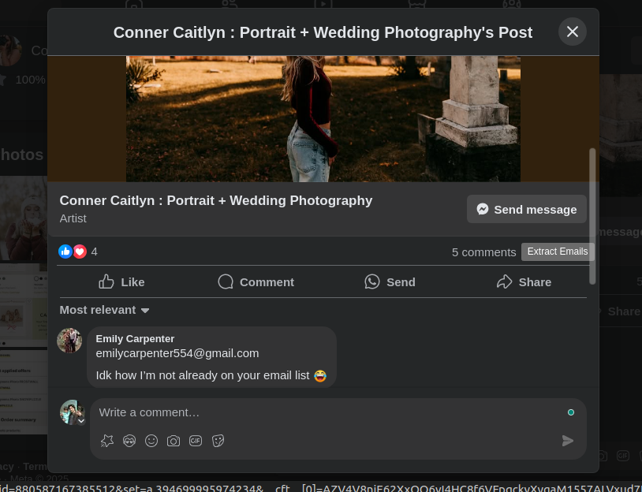

# ⚙ Facebook Comment Email Extractor

A browser extension that extracts email addresses from Facebook comments, designed to help users quickly collect emails without manual searching.

---

## ✨ Features
- 📧 Extracts email addresses from Facebook comments.
- 🔄 Automatically switches to "All comments" from "Most relevant."
- 🔽 Automatically scrolls through comments to capture all emails.
- 💾 Saves extracted emails to a downloadable text file.
- ⚡ Lightweight and easy to use.

---

## 📦 Installation

1. Clone or download this repository:
   ```bash
   git clone https://github.com/AfaqKhaliq/Email-Extractor-From-FB-Comments.git

2. Open your browser and navigate to the extensions page:

- For Chrome: chrome://extensions/
- For Edge: edge://extensions/

3. Enable Developer Mode.

4. Click on Load unpacked and select the folder containing the extension code.

5. The extension will appear in your toolbar.

## 🪛 How to Use

1. Open Facebook and navigate to a post with comments.

2. Click on the Comments section or the Comment icon to open the dialog.

3. The Extract Emails button will appear in the comments section.

4. Click the Extract Emails button and wait. The extension will:

- Automatically scroll through all comments.
- Switch to "All comments" if needed.
- Extract any emails it finds.
- A text file with the extracted emails will be downloaded automatically.

5. If no emails are found, a message will appear indicating this.

## 📸 Screenshots


#### Automatic Scrolling


#### Extraction Can be Viewed From Console





## 📄 License
This project is licensed under the MIT License.

